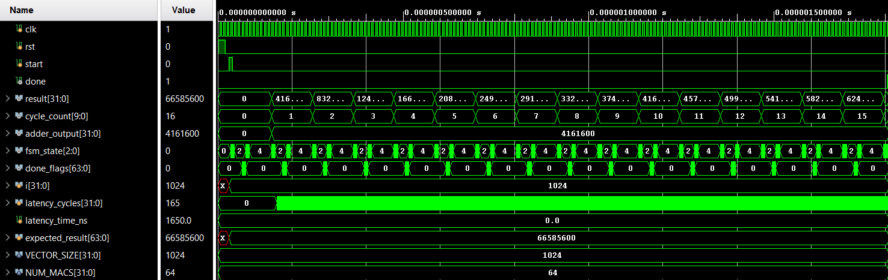

# Dense Vector-Vector Multiplier
A Parameterized .Verilog implementation of a High-Throughput Vector-Vector Multiplier
- **Configurable parallelism** (`NUM_MACS` from 1 – 256)  
- **Two-stage pipelined MAC** based on unrolled shift-and-add multiplication  
- **Four-stage pipelined Wallace Tree** with handshake for high FMAX  
- **Scalable dot product length** (`VECTOR_SIZE` up to 1024 elements)  
- **Final design** chosen after six architectural iterations 

## Architecture Overview
`Top-Level Data Path`


## Iteration Comparison

The final architecture was selected after evaluating six designs for area, speed, and scalability

  

## Performance Results

### Throughput Scaling @ Max FMAX

`Comparison Data Table`


`Comparison Graph`


### Throughput vs Area (Final Architecture)

`Efficiency Table`


`Trade-off Graph`


## Modules

### Source (`src/`)
| File | Description |
|------|-------------|
| **MAC.v** | Two-stage pipelined 8-bit × 8-bit MAC (16-bit output) |
| **Wallace_Tree.v** | 4-stage pipelined Wallace compressor (handshake I/F) |
| **Parallel_Vector.v** | Top-level controller: batches vectors, orchestrates MACs & Wallace Tree |

### Testbench (`testbench/`)
| File | Purpose |
|------|---------|
| **tb_MAC.v** | Unit test for a single MAC |
| **tb_WallaceTree.v** | Unit test for Wallace reduction |
| **tb_Parallel_Vector.v** | System-level test: configurable `NUM_MACS`, `VECTOR_SIZE` |

## Tools Used:
**Xilinx Nexys4 DDR** – FPGA implementation                                                                                           
**Vivado 2024.2** – Simulation, Synthesis and Testbenching   

## Testbench & Verification
The system testbench supports vectors up to **1024 elements** and sweeps `NUM_MACS` from 1 to 256 
It verifies:
* Functional correctness (`$display` PASS/FAIL)  
* Cycle latency & throughput metrics  
* FSM coverage and reset behaviour  

## Simulation Result – Max Stress Case

The following behavioral simulation demonstrates a full vector dot product computation with:

- `VECTOR_SIZE = 1024`  
- `NUM_MACS = 64`  
- Clock = 100 MHz  
- Fully matched output against expected result

### Console Output Summary


- **Result:** Correct product (66585600)
- **Cycles:** 16 (fully utilized pipeline)
- **Latency:** 165 cycles = 1650 ns
- **Throughput:** ~620 million elements/sec
- **MAC Utilization:** 100%

### 📸 Simulation Waveform



- `cycle_count` increments over 16 cycles
- `fsm_state` shows expected control states (IDLE → RUN → DONE)
- `done_flags`, `result`, and `expected_result` all match

## Quick Start Guide
Follow these steps to clone, simulate and synthesize the project

### 1. Clone the Repository
git clone https://github.com/kierancyh/Dense-Vector-Vector-Multiplier.git

### 2. Open in Vivado
**1. Launch Vivado 2024.2**    

**2. Create a New RTL Project**                                                       
- Name your project
- Select "Do not specify sources at this time"
                                 
**3. After project setup**                                                        
- Go to Add Sources
- Add all source files from the src/ folder
- Add all testbench files from the testbench/ folder
                                 
**4. Set Parallel_Vector.v as the Top Module (Full-System Test)**

### 3. Run Behavioral Simulation
**1. In the Flow Navigator, go to** 

Simulation → Run Simulation → Run Behavioral Simulation    

**2. Use the waveform viewer to inspect key signals such as**                        
- `done_flag`, `result`, `mac_outputs_flat` 
- FSM signals `state`, `in_valid`, `out_valid`

## Folder Structure
```plaintext
Vector_DotProduct_MAC/
├── README.md                                      # Main documentation with architecture + performance
├── LICENSE                                        # MIT License
├── .gitignore                                     # Ignores Vivado, waveform files, etc.
├── Architecture Diagram.png
├── Architecture Comparison.png
├── Throughput Scaling as Maximum FMAX Data.png
├── Throughput Scaling as Maximum FMAX Graph.png
├── Final Architecture Throughput Efficiency Data.png
├── Final Architecture Throughput vs Area Trade-off Across Varying MAC Configurations Graph.png
├── Waveform.png                                   # Simulation waveform (64 MACs)
├── Max Stress Test using 64 MACs.png              # Console output summary of stress test
├── src/
│   ├── MAC.v                                      # Pipelined MAC
│   ├── Wallace_Tree.v                             # 4-stage Wallace compressor
│   └── Parallel_Vector.v                          # Top module orchestrating the datapath
├── testbench/
│   ├── tb_MAC.v                                   # MAC testbench
│   ├── tb_WallaceTree.v                           # Wallace Tree testbench
│   └── tb_Parallel_Vector.v                       # System-level testbench
└── documents/
    ├── Design Report.docx                         # Full project write-up
    ├── Final Iteration Graphs.xlsx                # All performance plots
    └── Iteration Comparison.xlsx                  # Table summarising all six iterations
```

## License
This project is released under the MIT License
